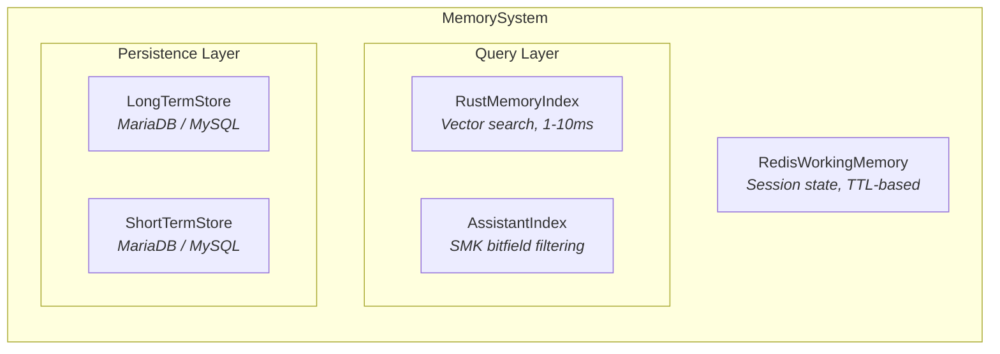
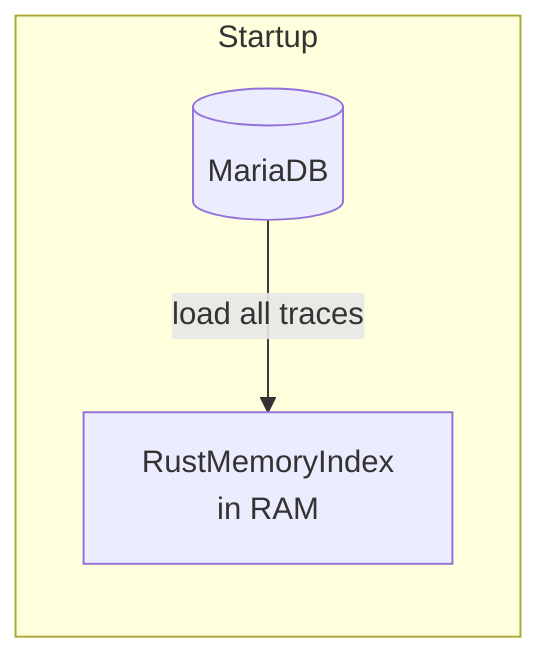
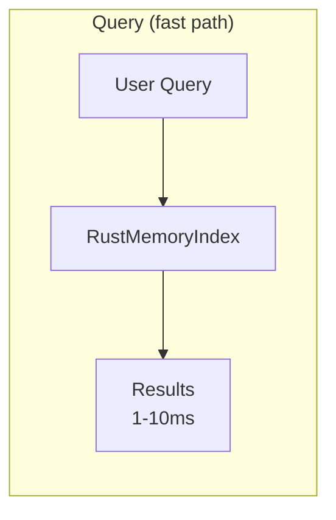
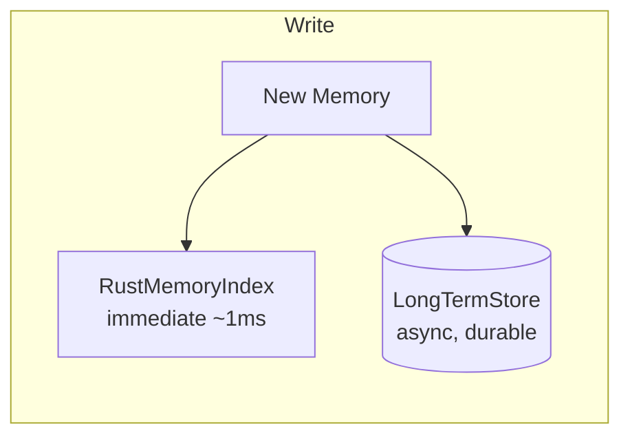

# MemoryCore

A high-performance memory engine for AI assistants, built with Rust and exposed to Python via PyO3.

MemoryCore provides fast in-memory vector search (1-10ms queries) backed by a Rust engine, with persistent storage through MariaDB/MySQL and session state via Redis. It's designed for per-user AI assistants that need near-instantaneous memory recall.

## Architecture



### Data Flow







## Requirements

- Python >= 3.12
- Rust toolchain (for building the native extension)
- MariaDB or MySQL (for persistent storage)
- Redis (for working memory / session state)

## Installation

```bash
# Clone the repo
git clone <repo-url> && cd MemoryCore

# Create a virtual environment
uv venv && source .venv/bin/activate

# Install dependencies and build the Rust extension
uv pip install -e ".[dev]"
maturin develop
```

## Quick Start

```python
from memory_core_py import (
    MemorySystem,
    RustMemoryIndex,
    LongTermStore,
    RedisWorkingMemory,
)

# Set up components
system = MemorySystem(
    memory_index=RustMemoryIndex(),
    ltm_store=LongTermStore(host="localhost", user="root", password="", database="memories"),
    working_mem=RedisWorkingMemory(redis_url="redis://localhost:6379"),
)

# Store a memory
await system.remember(
    user_id="alice",
    summary="Prefers Python for scripting tasks",
    embedding=[0.1, 0.2, ...],  # from your embedding model
    importance=0.8,
    tags=["preferences", "programming"],
)

# Recall relevant memories
results = await system.recall(
    user_id="alice",
    query_text="programming languages",
    query_embedding=[0.15, 0.25, ...],
    limit=5,
)
```

## SMK (Structured Memory Key) Index

The assistant-level index uses a packed 64-bit key for fast bitfield filtering before cosine similarity:

```python
from memory_core_py import AssistantMemoryIndex

index = AssistantMemoryIndex(dim=384)

# Add a memory with structured metadata
index.add(
    id=1,
    topic=1,        # RustPythonToolchain
    kind=1,         # Pattern
    tool_mask=0x07, # RS + PY + UV
    difficulty=2,   # High
    generality=2,   # High
    importance=2,   # High
    embedding=[...],
)

# Query with SMK filtering — prunes candidates before vector search
results = index.query_top_k_filtered(query=[...], k=5, smk_query=smk_query)
```

## Project Structure

```
MemoryCore/
├── src/                      # Rust implementation
│   ├── lib.rs                # PyO3 bindings (PyMemoryEngine, PyAssistantMemoryIndex)
│   └── smk_index.rs          # Structured Memory Key index
├── memory_core_py/           # Python package
│   ├── core/                 # Interfaces, models, system orchestrator
│   ├── storage/              # LTM (MariaDB), STM, Redis working memory
│   ├── indexing/             # RustMemoryIndex, AssistantMemoryIndex wrappers
│   └── types/                # SMK enums and feature extraction
├── examples/                 # Usage examples
├── docs/                     # Architecture documentation
├── Cargo.toml                # Rust dependencies
└── pyproject.toml            # Python project config (maturin build)
```

## Configuration

Storage connections are configured via environment variables:

| Variable | Default | Description |
|---|---|---|
| `LTM_DB_HOST` | `localhost` | MariaDB host for long-term storage |
| `LTM_DB_USER` | `root` | Database user |
| `LTM_DB_PASSWORD` | — | Database password |
| `LTM_DB_DATABASE` | `memory_core` | Database name |
| `STM_DB_HOST` | `localhost` | MariaDB host for short-term storage |
| `WORKING_MEM_URL` | `redis://localhost:6379` | Redis URL for working memory |
| `WORKING_MEM_TTL_SECONDS` | `3600` | Working memory TTL |

## License

MIT
