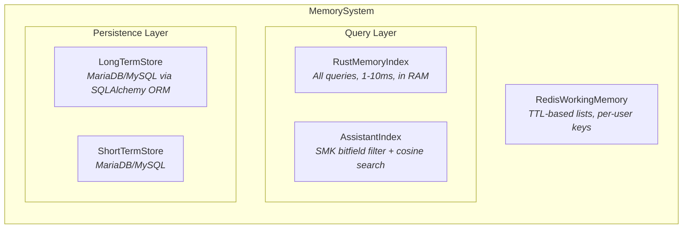
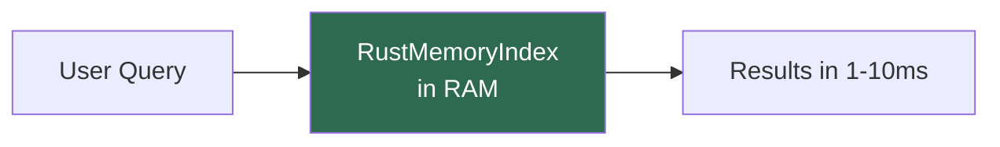
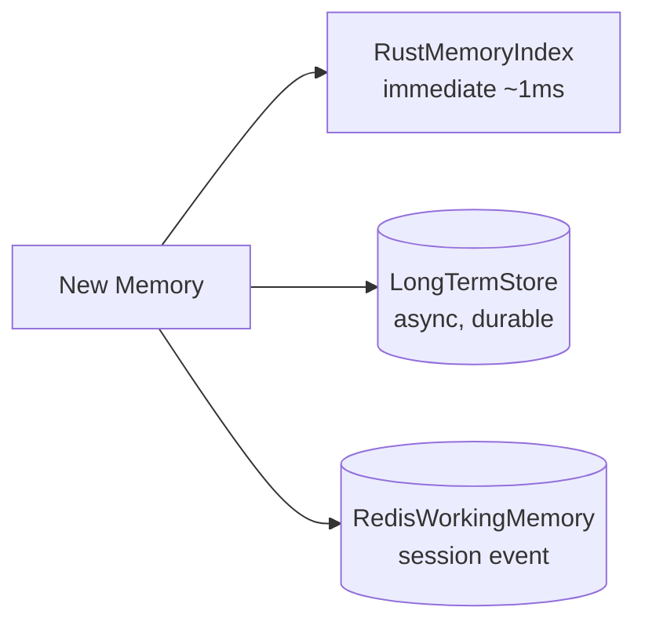
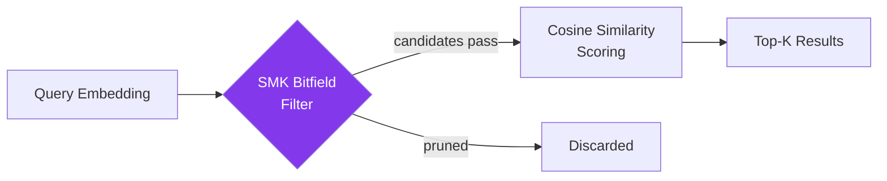
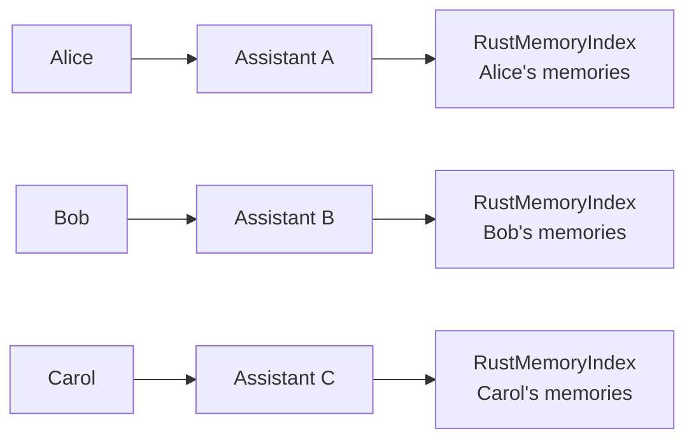

# Architecture

## Overview

MemoryCore separates **query** from **storage**. All runtime queries hit the Rust-backed in-memory index (1-10ms). The database is only used for persistence and startup loading.



## Data Flow

### Startup


### Query (fast path)



The database is never hit during queries.

### Write



### SMK Query Pipeline



## Components

### RustMemoryIndex

The primary query engine. Wraps `PyMemoryEngine` from the Rust extension.

- Stores embeddings as native `f32` vectors in Rust heap memory
- Cosine similarity search with keyword and tag boosting
- Score = `0.7 * semantic_similarity + 0.3 * importance`

```python
from memory_core_py import RustMemoryIndex

index = RustMemoryIndex()

# Ingest a trace
index.ingest(trace, embedding)

# Search — returns list[MemoryCandidate]
results = index.search(
    user_id="alice",
    text="programming languages",
    tags=["preferences"],
    limit=10,
    query_embedding=[0.1, 0.2, ...],
)
```

### LongTermStore

MariaDB/MySQL persistence via SQLAlchemy ORM. Embeddings are stored as JSON-encoded bytes in a `BLOB` column.

```python
from memory_core_py import LongTermStore

# Configured via env vars (LTM_DB_HOST, LTM_DB_USER, etc.)
# or explicit overrides
ltm = LongTermStore(host="localhost", user="root", password="secret", database="memories")

# Persist a trace + embedding
ltm.upsert_trace(trace, embedding=[0.1, 0.2, ...])
```

Constructor signature: `LongTermStore(*, settings=None, **overrides)`. Overrides accept `host`, `user`, `password`, `database`, `port`.

### RedisWorkingMemory

Short-lived session state stored in Redis lists with TTL-based expiry.

```python
from memory_core_py import RedisWorkingMemory

wm = RedisWorkingMemory(url="redis://localhost:6379", ttl_seconds=900)

await wm.add_event(user_id="alice", payload={"kind": "message", "text": "hello"})
events = await wm.get_recent(user_id="alice", limit=20)
```

Constructor signature: `RedisWorkingMemory(url=None, ttl_seconds=None, settings=None)`.

### AssistantMemoryIndex (SMK)

A second index for assistant-level learning traces. Uses a packed 64-bit Structured Memory Key for fast bitfield filtering before cosine similarity.

SMK bit layout:
```
bits  0-7:   topic (TopicBucket enum)
bits  8-10:  kind (MemoryKind enum)
bits 11-26:  tool_mask (16-bit flags)
bits 27-28:  difficulty (Level2Bits)
bits 29-30:  generality (Level2Bits)
bits 31-32:  importance (Level2Bits)
```

```python
from memory_core_py import AssistantMemoryIndex

index = AssistantMemoryIndex(dim=384)

# Ingest an AssistantMemoryTrace
index.ingest(trace, embedding)

# Query with SMK filters — prunes before vector search
from memory_core_py.types.smk_types import TopicBucket, MemoryKind, Level2Bits, ToolFlag

hits = index.query(
    query_embedding=[...],
    k=5,
    topic=TopicBucket.RUST_PYTHON_TOOLCHAIN,
    required_tools={ToolFlag.RS, ToolFlag.PY},
    allowed_kinds=[MemoryKind.PATTERN, MemoryKind.ANTI_PATTERN],
    min_generality=Level2Bits.HIGH,
    min_importance=Level2Bits.HIGH,
)
```

### MemorySystem

Orchestrator that wires everything together.

```python
from memory_core_py import MemorySystem, RustMemoryIndex, LongTermStore, RedisWorkingMemory

system = MemorySystem(
    memory_index=RustMemoryIndex(),
    ltm_store=LongTermStore(host="localhost", user="root", password="", database="memories"),
    working_mem=RedisWorkingMemory(url="redis://localhost:6379"),
    # optional:
    # assistant_index=AssistantMemoryIndex(dim=384),
    # stm_store=ShortTermStore(...),
    # stm_ttl_seconds=900,
)

# Store
trace = await system.remember(
    user_id="alice",
    summary="Prefers Python for scripting",
    importance=0.8,
    tags=["preferences"],
    embedding=[0.1, 0.2, ...],
)

# Recall — queries RustMemoryIndex only (fast)
results = await system.recall(
    user_id="alice",
    query_text="programming",
    tags=[],
    limit=10,
    query_embedding=[0.1, 0.2, ...],
)
# returns {"ltm_candidates": [...], "wm_events": [...], "stm_traces": [...]}
```

### build_memory_system

Factory function that constructs a `MemorySystem` from environment variables and optional overrides.

```python
from memory_core_py import build_memory_system

# Reads LTM_DB_*, STM_DB_*, REDIS_DB_* from environment
system = build_memory_system()

# Or with overrides
system = build_memory_system(overrides={
    "ltm": {"host": "db.example.com", "password": "secret"},
    "working_mem": {"url": "redis://cache:6379"},
    "enable_stm": False,
    "enable_assistant_index": True,
    "assistant_index_dim": 384,
})
```

## Per-User Assistant Pattern

Each user gets an isolated assistant with its own `RustMemoryIndex`. This gives natural memory isolation without multi-tenant filtering.



### With database persistence

```python
system = MemorySystem(
    memory_index=RustMemoryIndex(),
    ltm_store=LongTermStore(host="localhost", user="root", password="", database="memories"),
    working_mem=RedisWorkingMemory(),
)

# On startup: load user's traces from LTM into the Rust index
# At runtime: all queries hit RAM
# On write: both Rust index + LTM get updated
```

### Resource estimates per assistant

| Scale | Memories | RAM | Query Latency |
|---|---|---|---|
| Small | < 10k | ~150 MB | < 1ms |
| Medium | 10k-100k | ~300 MB | 1-10ms |
| Large | > 100k | ~500 MB | 10-100ms |

## Configuration

All settings use Pydantic `BaseSettings` with environment variable prefixes:

| Prefix | Component | Key Variables |
|---|---|---|
| `LTM_DB_` | LongTermStore | `HOST`, `USER`, `PASSWORD`, `DATABASE`, `PORT` |
| `STM_DB_` | ShortTermStore | `HOST`, `USER`, `PASSWORD`, `DATABASE`, `PORT` |
| `REDIS_DB_` | RedisWorkingMemory | `HOST`, `PORT`, `DATABASE`, `PASSWORD`, `URL` |
| `MEMORY_CORE_` | MemoryCoreSettings | `STM_TTL_SECONDS`, `ENABLE_STM`, `ENABLE_ASSISTANT_INDEX` |

DSNs are computed automatically: `mysql+mysqlconnector://{user}:{password}@{host}:{port}/{database}`.
