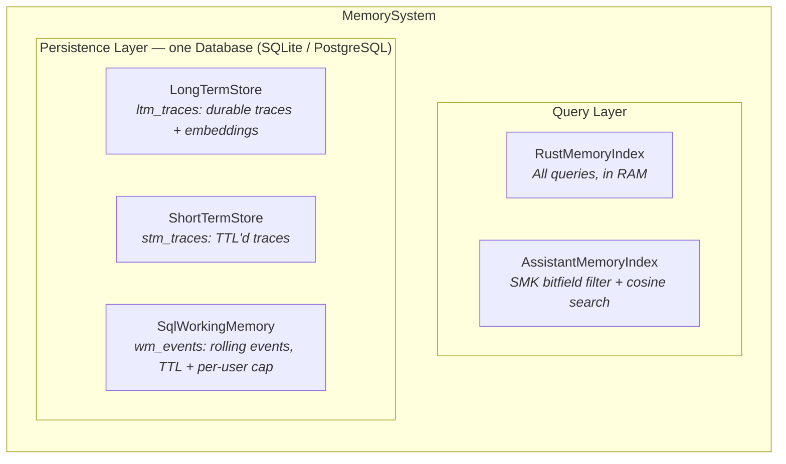
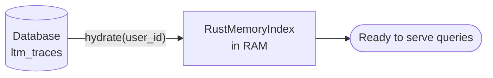
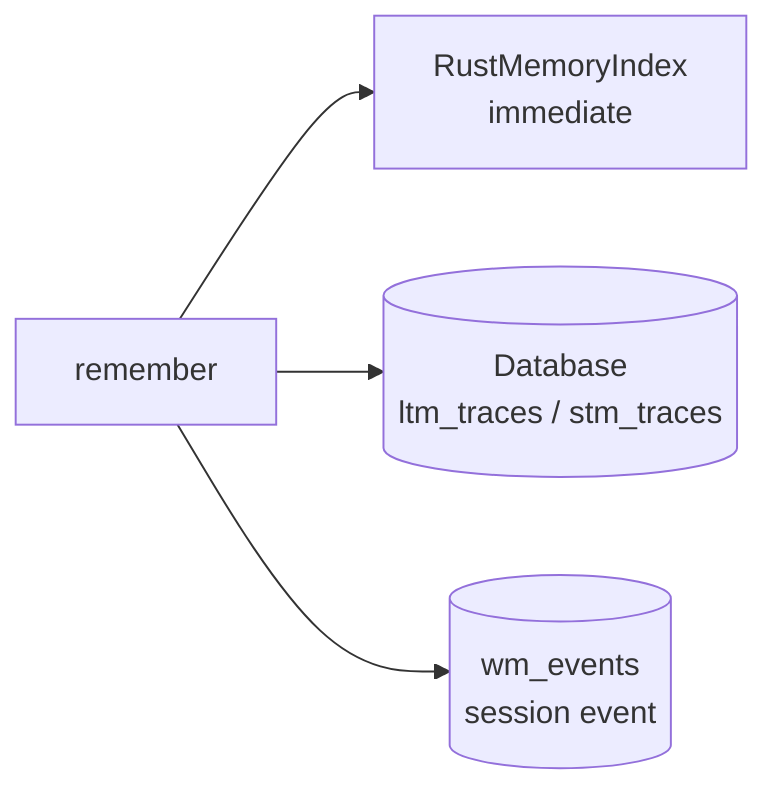
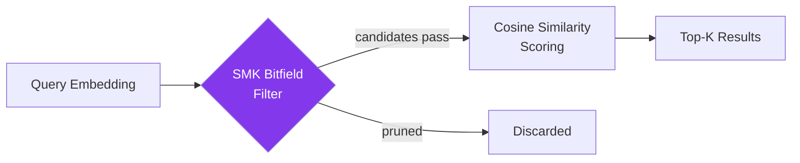

# Architecture

## Overview

MemoryCore separates **query** from **storage**. All runtime queries hit the Rust-backed
in-memory index (1-10ms). One SQL database — SQLite by default, any SQLAlchemy URL works —
is used for persistence and startup hydration only.



## Data flow

### Startup



`Database.create_schema()` creates missing tables idempotently (`build_memory_system` does
this by default), and `MemorySystem.hydrate(user_id)` replays each persisted trace with a
stored embedding into the index.

### Query (fast path)


`recall` searches the in-RAM index, marks returned candidates accessed, and attaches the
STM/WM sidebands. Store I/O runs in a worker thread (`asyncio.to_thread`), so the caller's
event loop never blocks on the database.

### Write



### SMK query pipeline



## Components

### Database

One engine + session factory + schema bootstrap, shared by every store.

```python
from memory_core import Database

db = Database(url="sqlite:///memory.db")   # or settings=DatabaseSettings(...)
db.create_schema()                          # idempotent
```

SQLite connections are created with `check_same_thread=False` (store calls run in worker
threads) and WAL journal mode (concurrent reader/writer turns don't block each other).
All datetimes are stored timezone-aware UTC, and expiry comparisons always use
Python-supplied bound parameters — never `func.now()` — so SQLite's string-typed datetime
comparisons stay consistent.

### RustMemoryIndex

The primary query engine. Wraps `PyMemoryEngine` from the Rust extension
(`memory_core._native`).

- Embeddings live as native `f32` vectors in Rust heap memory
- Cosine similarity with tag/keyword candidate seeding
- Score = `0.7 * semantic_similarity + 0.3 * importance`

### LongTermStore

Durable traces + embeddings in `ltm_traces`. Upserts use `Session.merge` (dialect-portable
— the same code runs on SQLite and PostgreSQL). Read paths:

```python
ltm.fetch_traces_for_user(user_id)  # [(MemoryTrace, embedding | None), ...] — hydration
ltm.delete_trace(trace_uid)         # permanent removal
```

### SqlWorkingMemory

Rolling per-user session events in `wm_events` — the same semantics the previous Redis
list had (TTL decay, newest last), with a per-user row cap so a chatty session can't grow
the table without bound. Expired rows are pruned opportunistically on every write.

```python
wm = SqlWorkingMemory(db, ttl_seconds=3600, max_events=500)
wm.add_event(user_id="alice", payload={"kind": "message", "text": "hello"})
events = wm.get_recent(user_id="alice", limit=20)
```

### ShortTermStore

TTL'd traces in `stm_traces` for recency recall; disabled by default
(`enable_stm=False`). `purge_expired()` deletes dead rows.

### AssistantMemoryIndex (SMK)

A second index for assistant-level learning traces, using a packed 64-bit Structured
Memory Key for bitfield filtering before cosine similarity. Internal ids derive from
`blake2b(trace_uid)` — deterministic across processes, so ids survive restarts.

SMK bit layout:

```
bits  0-7:   topic (TopicBucket)
bits  8-10:  kind (MemoryKind)
bits 11-26:  tool_mask (16-bit flags)
bits 27-28:  difficulty (Level2Bits)
bits 29-30:  generality (Level2Bits)
bits 31-32:  importance (Level2Bits)
```

### MemorySystem

The async orchestrator.

```python
from memory_core import build_memory_system

system = build_memory_system()                      # SQLite + schema, zero config
await system.hydrate("alice")                       # LTM → index
trace = await system.remember(user_id="alice", summary=..., importance=..., tags=[...],
                              embedding=[...])      # or configure an Embedder
result = await system.recall(user_id="alice", query_text=..., limit=10)   # RecallResult
await system.forget(trace.trace_uid)
await system.record_event(user_id="alice", payload={"kind": "turn", ...})
```

`RecallResult` carries `ltm_candidates` (index hits), `wm_events`, and `stm_traces`.

With an `Embedder` (any object with `async def embed(texts) -> vectors`), `remember`,
`recall`, `remember_assistant`, and `recall_assistant` all accept raw text and compute
embeddings internally.

## Per-user assistant pattern

Each user can get an isolated `MemorySystem` (own `RustMemoryIndex`) over one shared
`Database` — isolation at query time, one file on disk. See
`examples/per_user_assistant.py`.

## Configuration

| Prefix | Component | Key variables |
|---|---|---|
| `MEMORY_DB_` | Database | `URL` (SQLAlchemy URL; default `sqlite:///memory_core.db`) |
| `MEMORY_CORE_` | MemoryCoreSettings | `WM_TTL_SECONDS`, `WM_MAX_EVENTS`, `STM_TTL_SECONDS`, `ENABLE_STM`, `ENABLE_ASSISTANT_INDEX` |

Every setting has a working default; programmatic `overrides` beat the environment.
